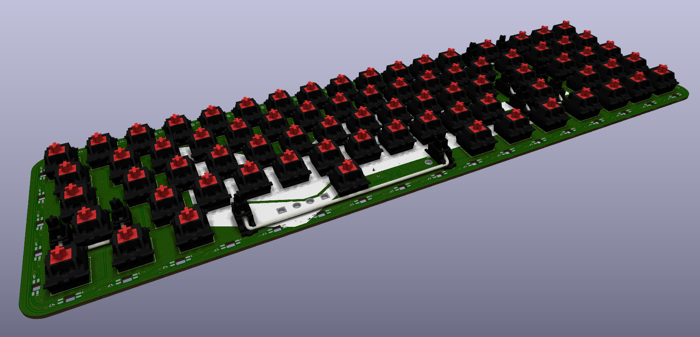

# Skayboard

## What?

Its **Skay**tacium's key**board**.

## Why? (I get this one a lot)

Good question.

## Layout?

[Here](http://www.keyboard-layout-editor.com/#/gists/023afb41bbd40c8d3c89d3bae84d59ea).

## Really, why?

I couldn't find a keyboard which had this exact layout (some suggested a 60% + numpad, do you think I'm sensible?).  
I also found the pre-existing PCBs too expensive and the open source ones had goofy layouts.  
I'm jobless, stupid and I regret everything.

## And?

- The `sk` keys are macro keys.
- It uses [QMK](https://qmk.fm/).
- Uses [SK6812 Mini-E](https://cdn-shop.adafruit.com/product-files/4960/4960_SK6812MINI-E_REV02_EN.pdf) LEDs, hand solder them if you want to, connection matrix [here](#connections) (because the name starts with SK).
+ The Skaytacium way to build one would be:
  - C3Equalz Tangerines, light green (52g)
  - 5mm acrylic plate
  - Stacked crylic and aluminum (layered)
- It took me ~~2~~ 3 years to make this (check earliest commit) because of the global chip shortage and doomerism.

## Details?

### PCB?
- 2 layer
- 355x107 mm
- AVR (32U4), keeping it as simple as possible.
	+ There is no ESD, overcurrent or surge protection on the PCB. I assume all modern electronic USB ports to compensate for that.
- Pads made for handsoldering.
- Curved traces, because the 90s were cool.
- **Not attached to the case in any way, only to the plate, allows for more customizable mounting options.**
- `svg` and `dxf` files for reference are in `lib/gen`.

#### Renders?
- Front

- Back

- Front populated

### Plate?
- Desgined for 5mm plates, but can be used for 3mm-5mm.
	+ 1.5mm should also be possible, but it is strongly not recommended to use that.
- Who am I to tell you though, go crazy with it, `dxf` file is in `lib/gen`.

#### Renders?

### Case?
- Stacked in the following order:
	+ Spacer (L2)
	+ Plate (PCB has no connection to the case)
	+ Spacer (L1)
	+ Spacer (L0)
	+ Case & Logo
- **IMPORTANT:** Spacers L1 and L0 should have atleast 6mm of total height due to the oscillator being an HC49, and that requires 4mm clearance + 1.6mm clearance for PCB thickness.
- **ALSO IMPORTANT:** Either one of spacers L1 or L0 have to be transparent, otherwise you won't be able to see the underglow LEDs (duh). But again, go crazy with it.
- **ALSO SERIOUSLY IMPORTANT:** The `dxf` files do not contain holes for threading, even though the renders show that, you'll have to choose your method of connection, i.e. glue or self-drilled screws. 
- Case & Logo are a single layer since the logo is just an inverse of the case cutout.
- All `dxf` files are in `lib/gen`.

#### Renders?
- Case & Logo

- Full case
